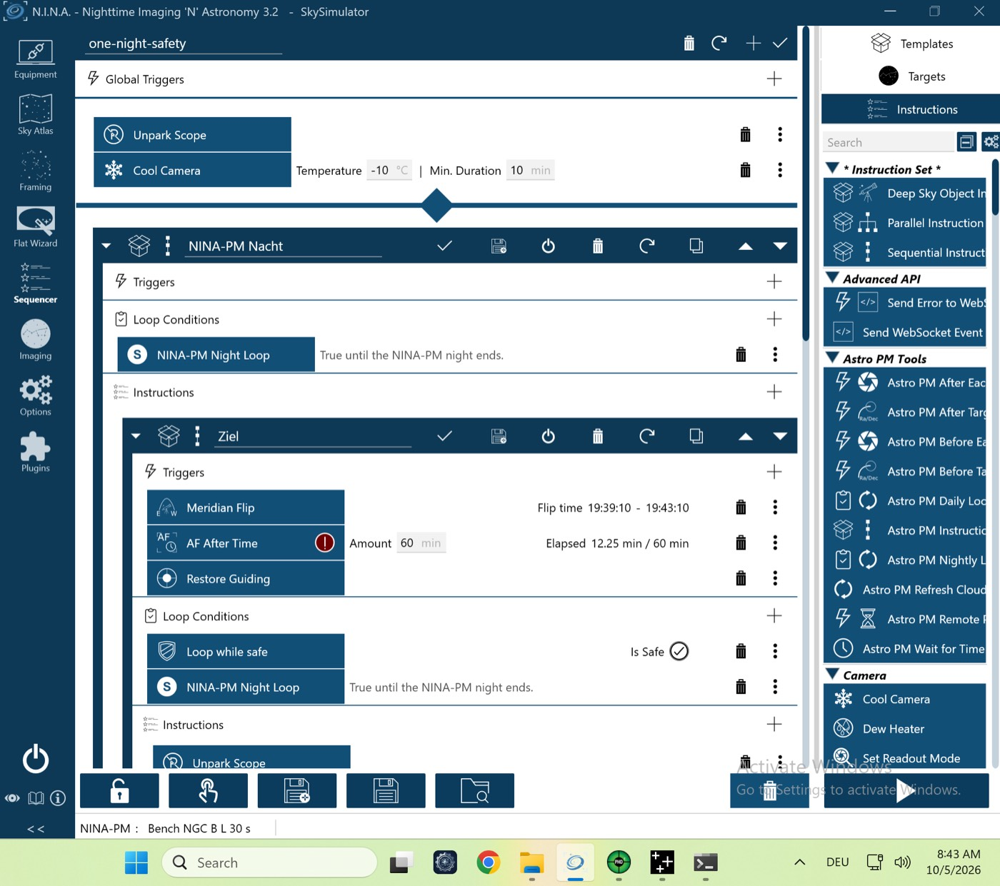

# VM-Lauf `real-night-flats` gegen den echten Server – 05.10.2026 (Stufe 2a)

Lauf `pnpm vm-bench run real-night-flats`, Plugin **0.4.4** (CI-Build von `main` 7f6a662, Engine 0.16.0).
- **Echter Server lokal** (PGlite, Demo-Seed), Nacht über den Standort gestaucht (Breite 50°, Zone `Etc/GMT+9`), Dunkelheit endet 25 min nach dem Start.
- **Ziele:** zwei Projekte, A mit L und Ha, B mit L, je 12 × 30 s.
- **Flats:** Panel aus dem Server-Rig, 3 Flats und 2 Dark-Flats je Kombination.
- Discord über die lokale Nachbildung.

| Gerät | Simulator | Zustand |
|---|---|---|
| Kamera | Camera Sky Simulator for ALPACA | verbunden, −10 °C |
| Montierung | Mount Sky Simulator for ALPACA | verbunden |
| Filterrad | Filterwheel Sky Simulator for ALPACA | verbunden |
| Guider | PHD2 (Simulator) | verbunden |
| Safety-Monitor | OmniSim Safety Monitor | verbunden, sicher |
| Rotator, Fokussierer, Kuppel, Flat-Panel | – | getrennt (Trained Flats ohne Panel) |

## Erster Versuch: NINA-Absturz der VM
- Um 15:13 (Mac-Zeit) brach NINA mit einer Zugriffsverletzung in `coreclr.dll` ab (`c0000005`, `app-events-absturz.txt`). Das ist der bekannte Absturz der x64-Emulation der VM, nicht des Plugins.
- Der Absturz-Wächter des Prüfstands holte die Windows-Ereignisse und startete den Lauf um 15:15 einmal neu.

## Ablauf des zweiten Versuchs (NINA-Log, Ortszeit der VM, UTC−5)
| Zeit | Ereignis |
|---|---|
| 08:15:08 | `PLAN reason=initial` vom echten Server, Session läuft |
| 08:15–08:27 | Block Projekt B (L), 11 Aufnahmen; `WAIT_PLAN` mehrfach, weil die Simulator-Kamera schneller fertig ist als geplant |
| 08:27:24 | Neuplanung; Block für die letzte Aufnahme von B. Davor `WAIT_PLAN` 309 s (**zu prüfen:** 5 min Warten vor der letzten Aufnahme) |
| 08:32:34 | B fertig: Der Server liefert es nicht mehr aus (`target_removed`), Block endet. Für A reicht die restliche Dunkelheit nicht (Mindestzeit je Ziel) |
| 08:39:51 | Ende der Dunkelheit: `FLATS_START`, Kombination L mit Dark-Flat-Gruppe done |
| 08:40:03 | `SESSION status=completed`, `finished`; 08:40:55 `pending=0` |

## Ergebnis
Server-Prüfungen (`report.json`) grün:
- Session abgeschlossen, Outbox beim Abschluss leer;
- 12 Lights, Zähler gleich gemeldeten Lights;
- Abschluss- und Bericht-Job erledigt, Discord-Meldung angekommen.

NINA-Log (`summary.json`): keine Fehler, nichts abgelehnt, Outbox am Ende leer.

Die Prüfung „mindestens 2 Flat-Kombinationen“ war **rot**. Sie war zu streng: Nach dem Neustart wurde nur Filter L belichtet, also gibt es nur eine Kombination, und die ist erledigt. Die Prüfung ist korrigiert (je belichtetem Filter eine erledigte Kombination, keine übersprungen; 758becc).

**Ergebnis: Go** (inhaltlich).

**Prüfpunkt 309 s geklärt (Analyse 05.10.2026):**
1. Der Block endete, sobald NINA die 12. Aufnahme belichtet hatte. Gespeichert und gemeldet wurde sie 2 s später, der sofortige `POST /plan` kannte sie also nicht. Der Server plante deshalb einen Block für eine Zeile, die schon fertig war. Behoben in **Plugin 0.4.6 (#273)**: Vor einer Neuplanung wartet das Plugin höchstens 15 s auf das Speichern.
2. Die 309 s sind genau die Zeit, die der Plan am Blockbeginn reserviert: Slew 120 s + Autofokus 180 s + Filterwechsel 10 s. In der VM gibt es keinen Fokussierer, und der Slew entfiel, weil das Ziel dasselbe war. Das Warten war seit #273 nicht unterbrechbar; jetzt läuft es im 10-s-Takt. Den Slew trotz gleichem Ziel plant die Engine weiter ein; das ist Folgearbeit an der Engine (`../rig-times/`).

