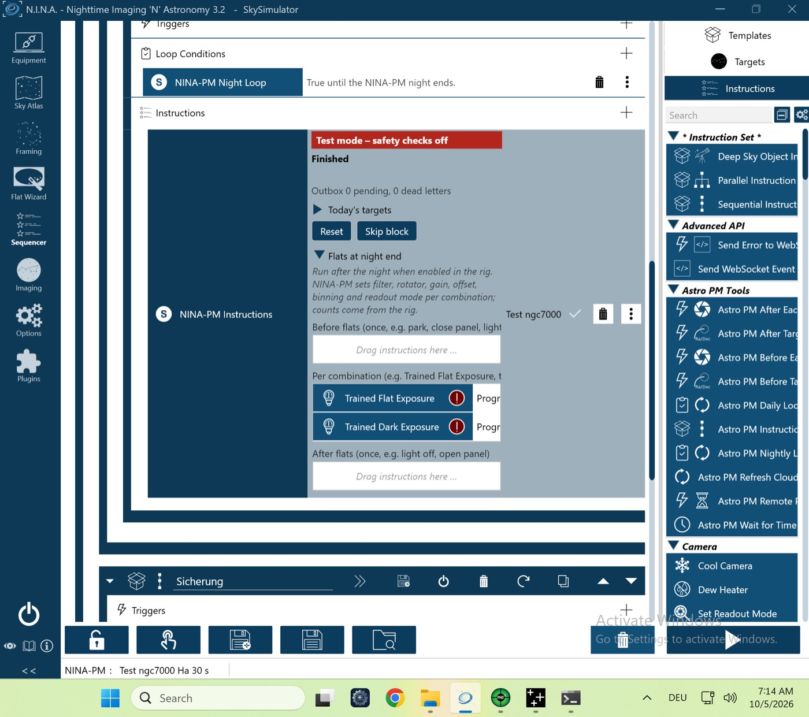

# VM-Lauf `vm-flats-auto` (P-38) – 05.10.2026 (VM-Prüfstand, echtes NINA 3.2)

Lauf `pnpm vm-bench run vm-flats-auto` gegen den Test-Server, Plugin **0.4.1**. Auto-Flats einmal je Projekt; beide Projekte haben schon Flats.

| Gerät | Simulator | Zustand |
|---|---|---|
| Kamera | Camera Sky Simulator for ALPACA | verbunden, −10 °C |
| Montierung | Mount Sky Simulator for ALPACA | verbunden |
| Filterrad | Filterwheel Sky Simulator for ALPACA | verbunden |
| Guider | PHD2 (Simulator) | verbunden |
| Safety-Monitor | OmniSim Safety Monitor | verbunden, sicher |
| Rotator, Fokussierer, Kuppel, Flat-Panel | – | getrennt |

## Ablauf (NINA-Log, Ortszeit der VM, UTC−5)
| Zeit | Ereignis |
|---|---|
| 07:02:46 | `PLAN reason=initial`, Session läuft |
| 07:06–07:13 | zwei Blöcke, der zweite endet am Nachtende (`reason=night_end`) |
| 07:13:42 | alle Kombinationen `covered`, **kein** Flat-Lauf; `SESSION status=completed pending=0`, `finished` |

## Ergebnis
Beide Prüfungen grün (`vm-check.txt`): alle Kombinationen `covered`, kein Flat-Lauf; Session abgeschlossen, nichts abgelehnt.

**Ergebnis: Go.**

