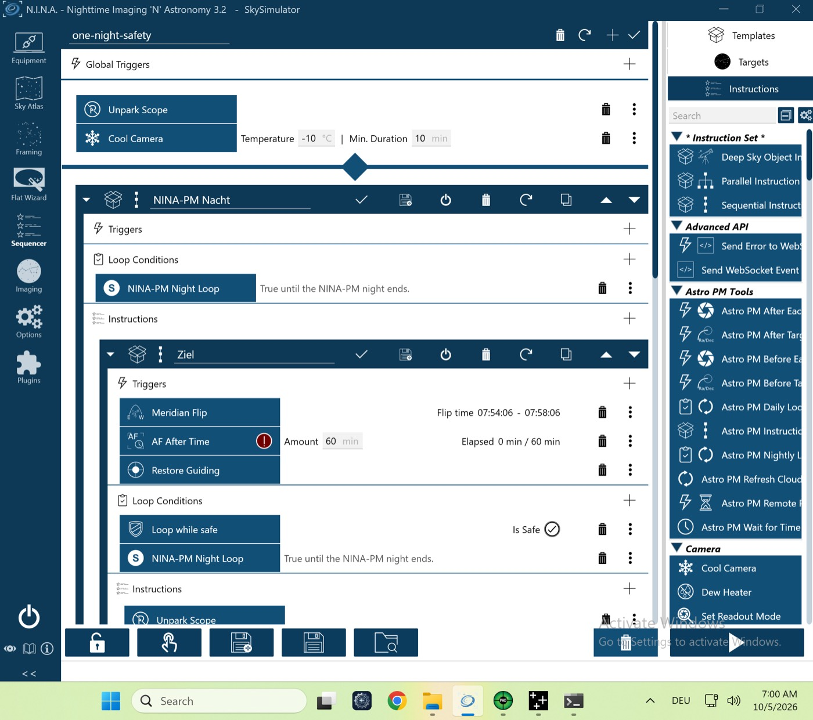

# VM-Lauf `vm-flats` (P-12 + P-35) – 05.10.2026 (VM-Prüfstand, echtes NINA 3.2)

Lauf `pnpm vm-bench run vm-flats` gegen den Test-Server, Plugin **0.4.1**. Erstmals mit Flat-Panel (OmniSim CoverCalibrator, Lücke B):
- *Vor Flats*: Abdeckung zu, Licht an;
- *Nach Flats*: Licht aus.

Flats nach der Nacht für L/Ha Bin 1 und L Bin 2 (Gain/Offset `null`), 5 je Kombination. NINA wird neu gestartet, sobald die 2. Kombination beginnt.

| Gerät | Simulator | Zustand |
|---|---|---|
| Kamera | Camera Sky Simulator for ALPACA | verbunden, −10 °C |
| Montierung | Mount Sky Simulator for ALPACA | verbunden |
| Filterrad | Filterwheel Sky Simulator for ALPACA | verbunden |
| Guider | PHD2 (Simulator) | verbunden |
| Safety-Monitor | OmniSim Safety Monitor | verbunden, sicher |
| Flat-Panel | OmniSim CoverCalibrator | verbunden |
| Rotator, Fokussierer, Kuppel | – | getrennt |

## Ablauf (NINA-Log, Ortszeit der VM, UTC−5)
| Zeit | Ereignis |
|---|---|
| 06:40:57 | `PLAN reason=initial`, Session läuft |
| 06:43–06:52 | Blöcke M 31 (mit Flip, `durationS=93`) und IC 1396 |
| 06:53:55 | `FLATS_START`; Panel: Abdeckung zu, Licht an, Helligkeit 50 (`panel.json`) |
| 06:54:26 | `L_b1` done, Dark-Flat-Gruppe Bin 1 done; `Ha_b1` beginnt, 1 Flat gespeichert |
| 06:54:31 | Prüfstand beendet NINA geordnet (Neustart in der 2. Kombination) |
| 06:54:40 | Nach dem Start sendet das Plugin aus der Outbox `SESSION status=completed`; die Flats laufen **nicht** weiter (kein `FLATS_RESUME`) |

## Ergebnis
**Rot.** Panel geschaltet (✓). Es fehlen aber `Ha_b1` und `L_b2` samt Dark-Flats, und das Licht blieb am Ende an (✗, `vm-check.txt`).

**Ursache:**
1. Beim geordneten Beenden trennt NINA zuerst die Geräte, auch den Safety-Monitor. NINA meldet dann „unsicher“.
2. Die Flats wurden unterbrochen, und *NINA-PM Wait until Safe or Night End* hat (Nacht vorbei, unsicher) nach der damaligen Regel H2 „Flats nur, falls sicher“ die restlichen Flats übersprungen und die Session abgeschlossen.
3. Am 04.10. lief derselbe Lauf noch grün; die Regel kam mit den Änderungen danach.

**Fix:** Plugin 0.4.4 (#270), Entscheidung Sven 05.10.2026: **Panel-Flats laufen auch bei „unsicher“** (das Dach in Starfront schließt je nach Lage schon zur Dämmerung); nur Himmelsflats verlangen „sicher“. Ein Abbruch während dieser Flats lässt die Kombination offen. Kopflos belegt mit `starfront-roof-flats`. Die Wiederholung von `vm-flats` mit 0.4.4 steht in der Folge vom 05.10. abends.

