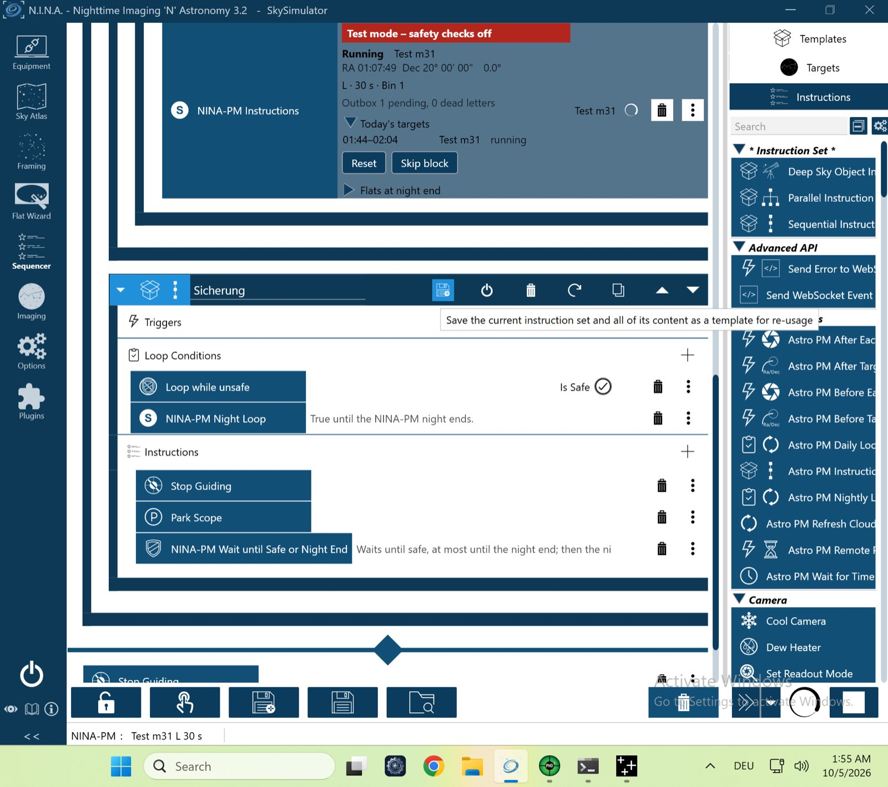

# VM-Kurzlauf `vm-flip` – 05.10.2026 (VM-Prüfstand, echtes NINA 3.2)

Lauf `pnpm vm-bench run vm-flip` gegen den Test-Server, Plugin **0.4.0** (CI-Build von `main` 4c87ec4). Meridian 8 min nach dem Serverstart, Flip nach NINAs frühester Flipzeit, nur Zentrieren. Ohne Handgriff.

| Gerät | Simulator | Zustand |
|---|---|---|
| Kamera | Camera Sky Simulator for ALPACA | verbunden, −10 °C |
| Montierung | Mount Sky Simulator for ALPACA | verbunden |
| Filterrad | Filterwheel Sky Simulator for ALPACA | verbunden |
| Rotator | Rotator Sky Simulator for ALPACA, `FULL` | verbunden |
| Guider | PHD2 (Simulator) | verbunden |
| Safety-Monitor | OmniSim Safety Monitor | verbunden, sicher |
| Fokussierer, Kuppel, Flat-Panel | – | getrennt |

## Ablauf (NINA-Log, Zeiten UTC)
| Zeit | Ereignis |
|---|---|
| 06:42:58 | `PLAN reason=initial`, `SESSION … status=running`, Vorlagenprüfung `start_wait_missing,start_autofocus_missing` (Prüfstand-Sequenz) |
| 06:53:37 | `FLIP pierBefore=west pierAfter=east durationS=91`, danach Zentrieren und weiter belichtet |
| 07:04:24 | Block `completed`; `PLAN reason=refresh` (Plan abgearbeitet). Der Test-Server liefert denselben, schon vergangenen Block wieder (feste Block-IDs) → `BLOCK_SKIPPED reason=elapsed` |
| 07:08:54 | Nachtende: `SESSION status=completed pending=0` |

## Ergebnis
Alle sieben Prüfungen grün (`vm-check.txt`): Flip am Eintrag `meridian_flip`, über die Pier-Seite erkannt, mit Dauer; nach dem Flip nur Zentrieren, Winkel modulo 180° in Toleranz; kein Nachrotieren (gleicher mechanischer Winkel aller 20 Aufnahmen); SiteCheck ohne Befund; Vorlagenprüfung mit genau den erwarteten Hinweisen; Nachtende mit leerer Outbox; keine Fehler.

**Ergebnis: Go.**

