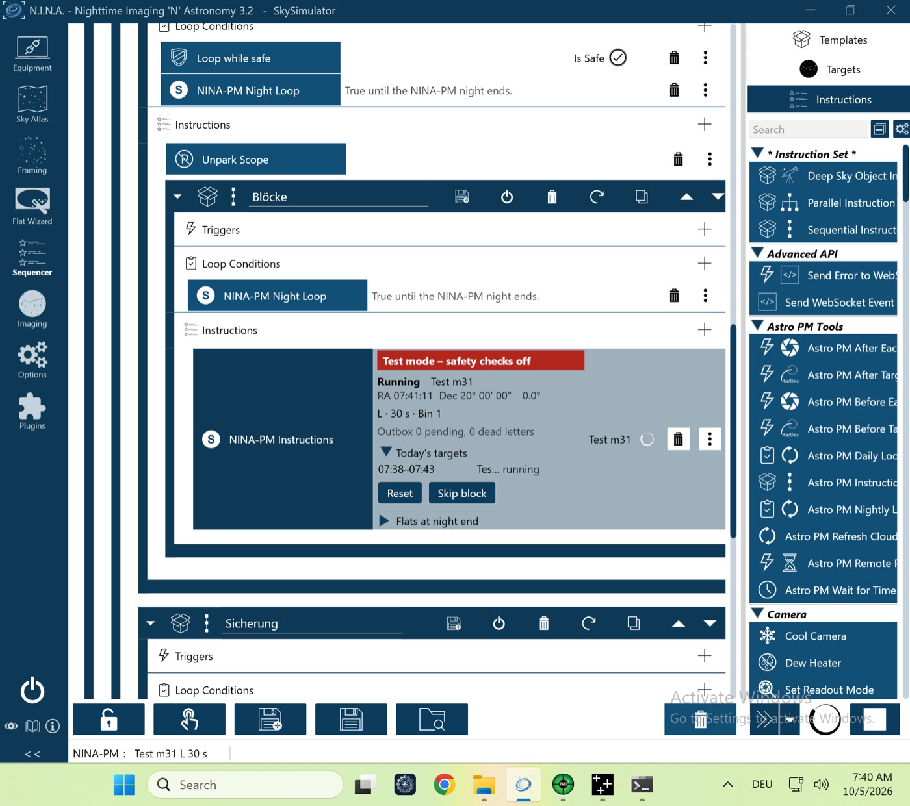

# VM-Lauf `vm-multi-night` (P-23 + P-24) – 05.10.2026 (VM-Prüfstand, echtes NINA 3.2)

Lauf `pnpm vm-bench run vm-multi-night` gegen den Test-Server, Plugin **0.4.1**. Sequenz „Mehrere Nächte“ über zwei verkürzte Nächte ohne NINA-Neustart: *NINA-PM Warten auf Zeit* (nautische Dämmerung + 2 min) vor jeder Nacht, Trigger-Box vor jeder Belichtung, höchstens 2 Nächte.

| Gerät | Simulator | Zustand |
|---|---|---|
| Kamera | Camera Sky Simulator for ALPACA | verbunden, −10 °C |
| Montierung | Mount Sky Simulator for ALPACA | verbunden |
| Filterrad | Filterwheel Sky Simulator for ALPACA | verbunden |
| Guider | PHD2 (Simulator) | verbunden |
| Safety-Monitor | OmniSim Safety Monitor | verbunden, sicher |
| Rotator, Fokussierer, Kuppel, Flat-Panel | – | getrennt |

## Ablauf (NINA-Log, Ortszeit der VM, UTC−5)
| Zeit | Ereignis |
|---|---|
| 07:16:21 | `DAYLOOP nights=0`, `WAIT_TIME` bis 07:18:20 |
| 07:18:22 | Nacht 1: `PLAN reason=initial`, Session `2026-10-04`, ein Block |
| 07:26:20 | Nacht 1 abgeschlossen (`completed pending=0`, `finished`) |
| 07:26:30 | `DAYLOOP night=2026-10-05`, `WAIT_TIME` bis 07:38:20 |
| 07:38:22 | Nacht 2: neuer Plan, Session `2026-10-05`, ein Block |
| 07:46:20 | Nacht 2 abgeschlossen; 07:46:30 `DAYLOOP_END reason=max_nights` |

## Ergebnis
Alle fünf Prüfungen grün (`vm-check.txt`):
- zwei Sessions mit verschiedenen Nacht-Schlüsseln, ohne NINA-Neustart;
- *Warten auf Zeit* endet zur nautischen Dämmerung + 2 min (±30 s), erst danach Plan und Blöcke;
- Trigger-Box vor jeder Belichtung;
- Ende nach der Höchstzahl Nächte;
- nichts abgelehnt.

**Ergebnis: Go.**

