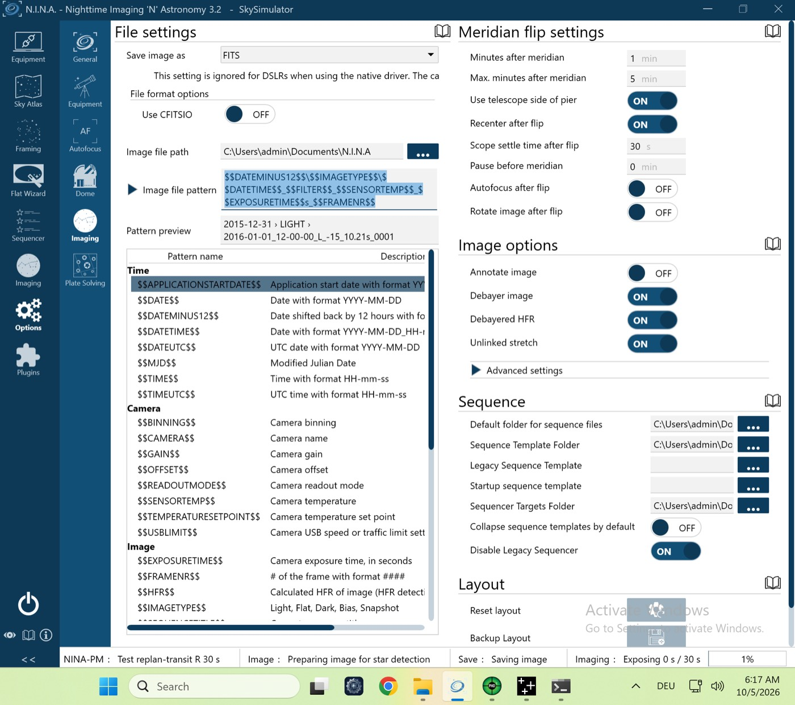

# VM-Lauf `vm-replan-transit` (P-15b) – 05.10.2026 (VM-Prüfstand, echtes NINA 3.2)

Lauf `pnpm vm-bench run vm-replan-transit` gegen den Test-Server, Plugin **0.4.1**. Langer Deep-Sky-Block; in Minute 4 legt der Test-Server einen Transit fest (`lock_transit`), Fenster ab Minute 15. Ohne Handgriff.

Der erste Versuch um 12:54 (Mac-Zeit) wurde abgebrochen: Die Platte der VM war voll. Die Simulator-Kamera ignoriert die Belichtungszeit, und Transitserien erzeugten Hunderte FITS-Dateien. Seitdem löscht der Prüfstand vor jedem Lauf die Bilder (`clean-images`). Dieses Protokoll beschreibt den zweiten Versuch.

| Gerät | Simulator | Zustand |
|---|---|---|
| Kamera | Camera Sky Simulator for ALPACA | verbunden, −10 °C |
| Montierung | Mount Sky Simulator for ALPACA | verbunden |
| Filterrad | Filterwheel Sky Simulator for ALPACA | verbunden |
| Guider | PHD2 (Simulator) | verbunden |
| Safety-Monitor | OmniSim Safety Monitor | verbunden, sicher |
| Rotator, Fokussierer, Kuppel, Flat-Panel | – | getrennt |

## Ablauf (NINA-Log, Ortszeit der VM, UTC−5)
| Zeit | Ereignis |
|---|---|
| 06:00:01 | `PLAN reason=initial`, Session läuft |
| 06:02:28 | Deep-Sky-Block beginnt |
| 06:05:46 | Transit erkannt: `BLOCK_END reason=transit_interrupt`; die laufende Belichtung endete regulär, kein Abbruch. Danach `PLAN reason=refresh`, Rest des Deep-Sky-Blocks bis zum Transit |
| 06:12:58 | Transitblock: Slew und Zentrieren, `TRANSIT_START` 06:15:00 (Fensterbeginn) bis `untilUtc` 06:35 |
| 06:34:27 | `TRANSIT_END`, Block `completed`, Neuplanung |

## Ergebnis
Alle drei Prüfungen grün (`vm-check.txt`):
- der Block endet mit `transit_interrupt`, die laufende Belichtung läuft zu Ende;
- neuer Plan mit dem Transit am Fensterbeginn;
- Serie bis `untilUtc`, nichts abgelehnt.

Über 540 Transit-Aufnahmen in 20 min, weil die Simulator-Kamera die Belichtungszeit ignoriert.

**Ergebnis: Go.**

