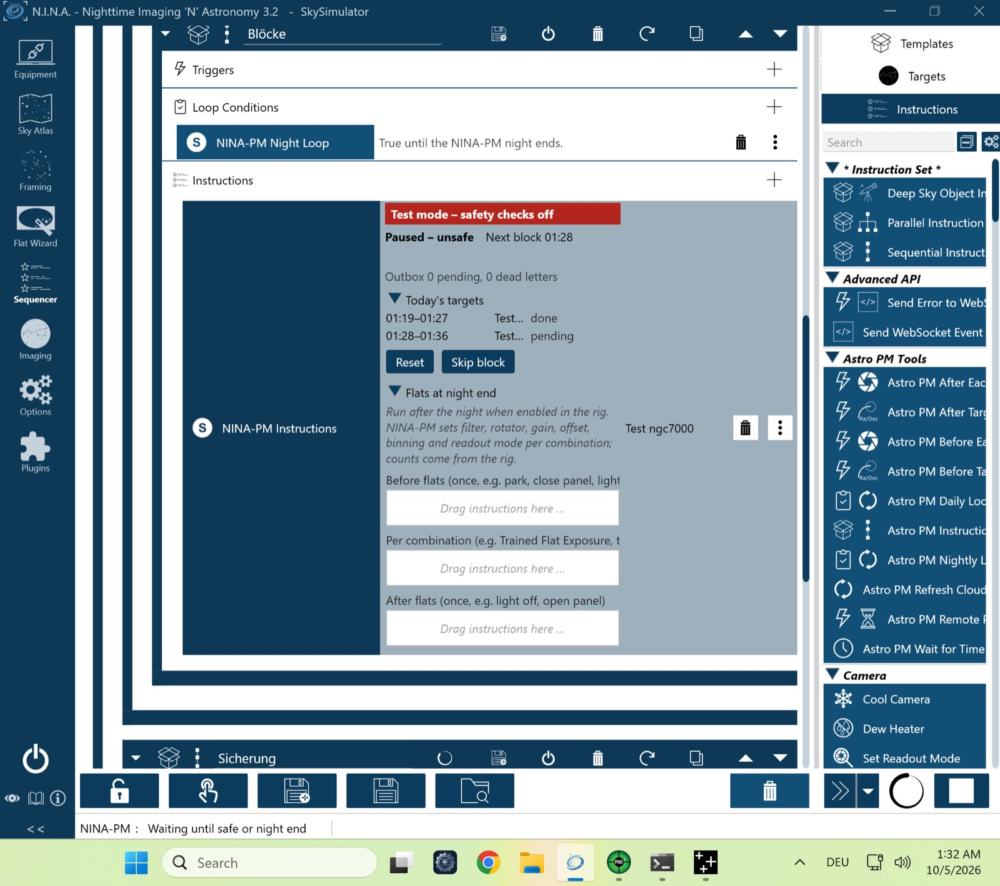

# VM-Kurzlauf `vm-smoke` – 05.10.2026 (VM-Prüfstand, echtes NINA 3.2)

Lauf `pnpm vm-bench run vm-smoke` gegen den Test-Server, Plugin **0.4.0** (CI-Build von `main` 4c87ec4, Analyse-Pakete #257–#262). Ohne Handgriff. Erster Lauf der Regression nach den Paketen 1–5.

| Gerät | Simulator | Zustand |
|---|---|---|
| Kamera | Camera Sky Simulator for ALPACA | verbunden, −10 °C (ab Minute 5 Sollwert abweichend) |
| Montierung | Mount Sky Simulator for ALPACA | verbunden |
| Filterrad | Filterwheel Sky Simulator for ALPACA | verbunden |
| Guider | PHD2 (Simulator) | verbunden |
| Safety-Monitor | OmniSim Safety Monitor | verbunden; unsicher bei Minute 13,3, wieder sicher bei Minute 15 |
| Rotator, Fokussierer, Kuppel, Flat-Panel | – | getrennt (Rig des Test-Servers mit Rotator → `rotator_unavailable` je Block, erwartet) |

## Ablauf (NINA-Log, Zeiten UTC)
| Zeit | Ereignis |
|---|---|
| 06:17:55 | `PLAN reason=initial`, `SESSION … status=running`, Vorlagenprüfung `start_wait_missing,start_autofocus_missing,dither_trigger_present` (Prüfstand-Sequenz), `nina_dither_trigger_present` |
| 06:27:07 | Block 1 `completed` |
| 06:31:15 | Safety unsicher: Belichtung abgebrochen, Block 2 `interrupted`, `SAFETY_PAUSE` |
| 06:33:02 | Wieder sicher: `SAFETY_RESUME`, `PLAN reason=resume`, Block 2 fortgesetzt |
| 06:36:06 | Block 2 `completed` |
| 06:38:02 | `PLAN reason=refresh` (Plan abgearbeitet, Nacht läuft noch – gewollt) |
| 06:38:54 | Nachtende: `SESSION status=completed pending=0` |

## Ergebnis
Alle sieben Prüfungen grün (`vm-check.txt`): Profil im Heartbeat, 21 Aufnahmen mit Messwerten gemeldet, Dither-Trigger unterdrückt, Kühlungsabweichung (weiterbelichtet, je Block eine Warnung), Safety-Pause und Wiederaufnahme, Nachtende mit leerer Outbox, keine Fehler und keine abgelehnte Anfrage.

**Zwischenfälle (kein Plugin-Befund):**
- **Erster Start 06:14:** NINA stürzte 30 s nach dem Sessionstart ab (`System.AccessViolationException` in `coreclr.dll`, `0xc0000005`, ohne Eintrag im NINA-Log, Windows-Ereignisprotokoll). Gleiches Muster wie am 03.10. und 04.10. mit älteren Plugins: Instabilität der x64-Emulation in der VM (Windows auf Apple Silicon). Der zweite Start lief sauber. Der Prüfstand erfasst solche Abstürze jetzt selbst und wiederholt den Lauf einmal.
- **Nach dem Ergebnis** beendete sich der Prüfstand-Prozess nicht von selbst (offene Server-Handles); die Lauffolge blieb stehen. Behoben in #263.
- `ERROR … SetCCDTemperature … clamped` im NINA-Log: Kamera-Simulator, kein Plugin-Fehler.

**Ergebnis: Go.**

