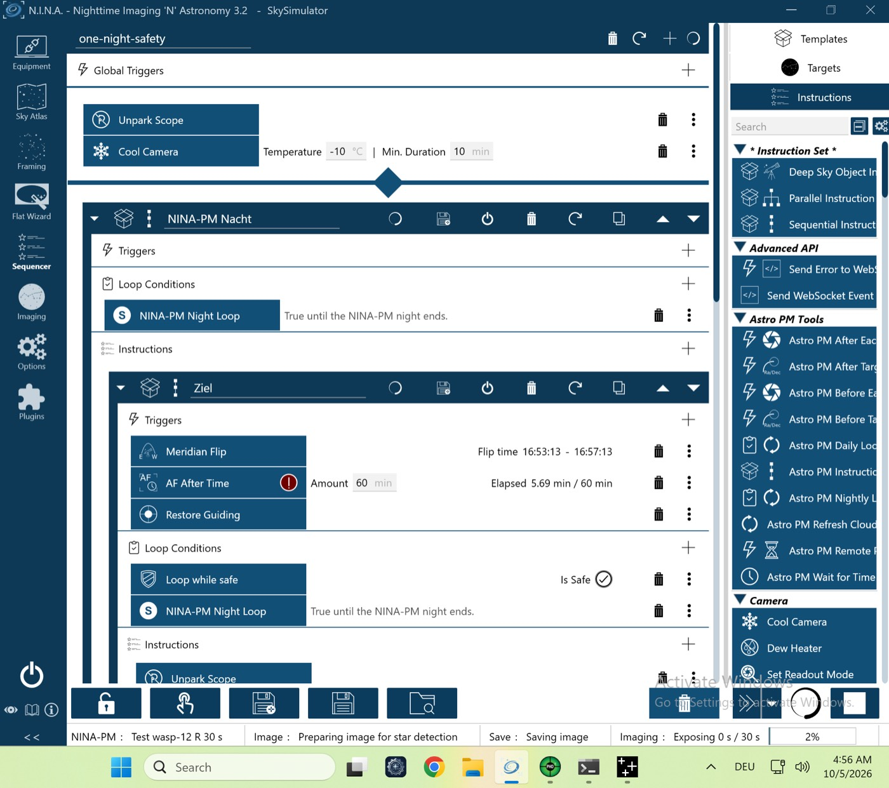

# VM-Lauf `vm-transit-flip` (P-27) – 05.10.2026 (VM-Prüfstand, echtes NINA 3.2)

Lauf `pnpm vm-bench run vm-transit-flip` gegen den Test-Server, Plugin **0.4.1**. Meridian in Minute 18 mitten im Transitfenster (ab Minute 10, 25 min); NINA-Profil mit *Recenter* an. Ohne Handgriff.

| Gerät | Simulator | Zustand |
|---|---|---|
| Kamera | Camera Sky Simulator for ALPACA | verbunden, −10 °C |
| Montierung | Mount Sky Simulator for ALPACA | verbunden |
| Filterrad | Filterwheel Sky Simulator for ALPACA | verbunden |
| Guider | PHD2 (Simulator) | verbunden |
| Safety-Monitor | OmniSim Safety Monitor | verbunden, sicher |
| Rotator, Fokussierer, Kuppel, Flat-Panel | – | getrennt |

## Ablauf (NINA-Log, Ortszeit der VM, UTC−5)
| Zeit | Ereignis |
|---|---|
| 04:34:15 | `PLAN reason=initial`, Session läuft |
| 04:38:33–04:39:58 | Block 1 regulär |
| 04:42:10 | Transitblock: Slew und Zentrieren vor dem Fenster, `TRANSIT_START` 04:44:11 bis `untilUtc` |
| 04:54:51 | NINA flippt mitten in der Serie: `FLIP pierBefore=west pierAfter=east durationS=95`, danach geht die Serie weiter |
| 05:08:39 | `TRANSIT_END`, Block `completed`, Neuplanung; der Test-Server liefert den vergangenen Block wieder → `BLOCK_SKIPPED reason=elapsed` |

## Ergebnis
Alle vier Prüfungen grün (`vm-check.txt`):
- Hinweis `flip_in_transit` schon beim Planaufbau (Lücke im Plan ausgewiesen);
- NINA flippt in der Serie;
- die Serie läuft danach bis `untilUtc`, alle Aufnahmen mit `transitObservationId`;
- *Recenter* an löst den Alarm `recenter_after_flip_on` aus, nichts abgelehnt.

**Ergebnis: Go.**

